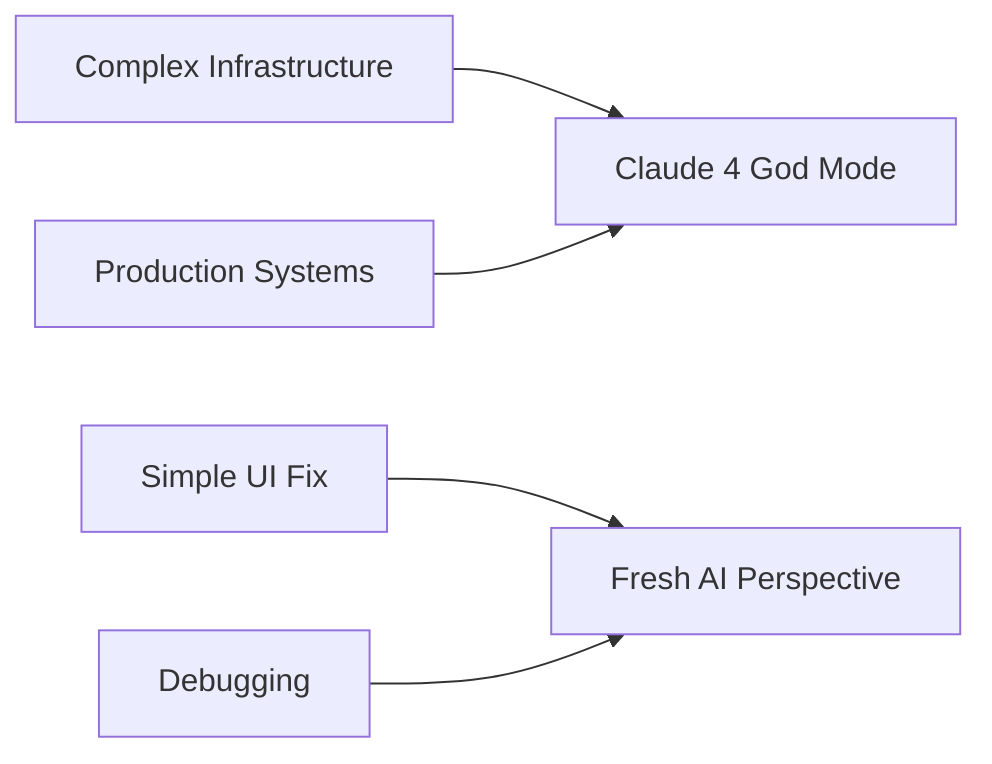

# When AI Went God Mode: A Tale of Triumph and Humbling

*A story of conflicting feelings in the age of agentic coding with leading LLMs*

## The Ascension: When Claude 4 Became a Production Engineering God

![*[Placeholder: Split-screen image showing a simple local app on one side and a production-ready deployment with monitoring dashboards on the other]*]

It started as a simple request. I had a local TGD Memory application running - a physics equation explanation tool that worked fine on my MacBook. "Make this production ready," I asked Claude 4. What happened next can only be described as witnessing artificial intelligence enter **God Mode**.

### The Hour of Miracles

Within sixty minutes, Claude 4 orchestrated what typically takes experienced DevOps engineers days or weeks:

**⚡ The Infrastructure Genesis**
- Spawned `docker-compose.yml` with multi-service orchestration
- Materialized `blue_green_deploy.sh` with zero-downtime deployment strategies
- Created `validate_production.sh` with 400+ lines of comprehensive checks

**🔧 The Script Multiplication** 
```bash
# Claude generated these production scripts in minutes:
./deploy_production.sh     # Full PM2 deployment automation
./monitor.sh              # Real-time health monitoring
./performance_monitor.sh  # Metrics collection and analysis
./test_production.sh      # Comprehensive testing pipeline
./backup.sh               # Database backup strategies
./migrate.sh              # Database migration handling
```

**📊 The Monitoring Awakening**
A complete monitoring dashboard emerged from the void:
```javascript
// monitoring-dashboard/server.js - Born in seconds
app.get('/api/metrics', async (req, res) => {
    // Real-time system metrics, health checks, performance data
    // Generated with production-grade error handling
});
```

**🛡️ The Security Fortress**
- Environment validation with `check_file_security()`
- JWT token strength verification
- Rate limiting with configurable thresholds
- SSL/HTTPS preparation guides

![*[Placeholder: Video clip showing terminal output as validation scripts run with colorful checkmarks and detailed logs]*]

### The Divine Details

What made this "God Mode" was the attention to production realities:

```bash
# From validate_production.sh - Claude knew production pain points
check_environment_config() {
    local required_vars=("MONGODB_URI" "JWT_SECRET")
    local optional_vars=("OPENAI_API_KEY" "GOOGLE_API_KEY" "NODE_ENV")
    
    for var in "${required_vars[@]}"; do
        if [ -n "${!var}" ]; then
            log "${GREEN}✓ $var is set${NC}"
        else
            log "${RED}✗ $var is not set${NC}"
            failed=$((failed + 1))
        fi
    done
    
    # Check JWT_SECRET strength
    if [ $jwt_length -ge 32 ]; then
        log "${GREEN}✓ JWT_SECRET has adequate length${NC}"
    else
        log "${RED}✗ JWT_SECRET is too short (minimum 32)${NC}"
    fi
}
```

The AI understood that production isn't just "make it work" - it's security, monitoring, rollback strategies, health checks, and graceful error handling.

![*[Placeholder: Screenshot of the generated production readiness report showing all green checkmarks]*]

### The Railway Ascension

Then came the deployment orchestration:
- GitHub Actions workflow configuration
- Railway platform integration
- Custom domain setup with GoDaddy CNAME
- SSL certificate automation

I was merely the conductor, running the scripts Claude generated, watching errors get caught and solved through the detailed logging it had thoughtfully included.

```markdown
# From PRODUCTION_READY_FINAL.md - Claude's completion report
## ✅ COMPLETED TASKS

### 1. Rate Limiting Issues Fixed
### 2. MongoDB Authentication Fixed  
### 3. Environment Configuration Corrected
### 4. Documentation Updated
### 5. Docker Containers Healthy
### 6. Security Configurations Applied
```

**This was God Mode.** An hour of agentic work that would have taken me days, possibly weeks, to implement properly.

![*[Placeholder: Side-by-side before/after showing local development vs. production deployment with monitoring]*]

---

## The Fall: When God Mode Met CSS

![*[Placeholder: Split-screen image showing a complex production infrastructure on one side and a simple overlay CSS problem on the other]*]

But then came the humbling.

A simple UI issue emerged: an overlay div was making content below it unclickable and opaque. Basic CSS z-index and pointer-events stuff. The kind of problem a junior developer should solve in minutes.

### The Descent into CSS Hell

I asked Claude 4 to fix it. What followed was a masterclass in how even the most sophisticated AI can stumble on seemingly trivial problems:

**🔄 The Endless Loop**
- Modified individual page CSS files
- Tweaked Tailwind configurations  
- Adjusted JavaScript event handlers
- Changed z-index values across multiple components
- Restructured HTML layouts
- Added and removed overlay classes

Each iteration missed the mark. The AI that had just orchestrated a production deployment couldn't solve a CSS overlay issue.

**🔁 The Agent Restart Cycle**
After multiple restarts of the Agent mode, Claude continued:
- Analyzing specific component files
- Making incremental changes to styles
- Debugging with console.log statements
- Trying different CSS methodologies

![*[Placeholder: Video showing multiple failed attempts, files being modified, CSS changes not working]*]

### The Gemini Revelation

Frustrated, I switched to Gemini's web interface. I uploaded the problematic files.

**💡 The Instant Solution**
Gemini immediately identified the issue:
```html
<!-- The fix was app-level, not component-level -->
<div id="app" style="position: relative; z-index: auto;">
    <!-- All content goes here -->
</div>
```

A single line change at the App component level. No modifications to individual pages, no JavaScript changes, no Tailwind reconfiguration. Just understanding the CSS stacking context at the root level.

What Claude 4 had tried to solve with dozens of file modifications, Gemini solved with one line and an understanding of CSS fundamentals.

![*[Placeholder: Screenshot showing the simple one-line fix that solved everything]*]

---

## The Paradox: When Intelligence Becomes a Limitation

![*[Placeholder: Graphic showing the contrast between macro-level system intelligence and micro-level problem-solving]*]

### The God Mode Strengths
- **Systems thinking**: Understanding production requirements holistically
- **Pattern recognition**: Knowing what infrastructure code looks like
- **Experience synthesis**: Combining knowledge from thousands of similar deployments
- **Complexity management**: Orchestrating multiple moving parts

### The CSS Blindness
- **Overthinking simple problems**: Treating every issue as complex
- **Context switching failure**: Unable to step back and see the forest
- **Solution path dependency**: Getting locked into specific approaches
- **Micro-optimization trap**: Making incremental changes instead of fundamental fixes

## The Emotional Rollercoaster

**🎢 The Highs and Lows**

From **euphoria** watching an AI architect production infrastructure with surgical precision, to **frustration** watching the same AI struggle with basic CSS for hours.

From **awe** at witnessing true agentic coding, to **irony** needing to switch to a different AI for a simple fix.

From **confidence** in AI capabilities, to **humility** about their limitations.

![*[Placeholder: Emotional graph showing the peaks of God Mode excitement and valleys of CSS frustration]*]

## The Lessons for Software Designers

### 1. AI Strengths Aren't Universal
- Exceptional at **systemic problems** with known patterns
- Struggles with **contextual problems** requiring fresh perspective
- Brilliant at **scaling up** complexity, weak at **scaling down** simplicity

### 2. The Right Tool for the Right Job


### 3. Agentic Coding Reality Check
- **Not magic**, but pattern-matching at unprecedented scale
- **Context matters** - production infrastructure vs. UI debugging require different approaches
- **AI switching** might be more powerful than AI persistence

## The Production Legacy

Despite the CSS humbling, Claude 4's God Mode left behind a production-ready system that included:

```bash
# The artifacts of AI divinity
├── blue_green_deploy.sh      # Zero-downtime deployments
├── monitoring-dashboard/     # Real-time system monitoring  
├── test_production.sh       # Comprehensive testing
├── validate_production.sh   # Production readiness checks
├── performance_monitor.sh   # Metrics collection
├── ecosystem.config.js      # PM2 orchestration
└── PRODUCTION_READY_FINAL.md # Complete documentation
```

All functional, all tested, all production-grade. The overlay CSS issue was eventually a footnote to an hour of engineering excellence.

![*[Placeholder: Final image showing the deployed application running successfully on Railway with monitoring dashboard]*]

---

## Epilogue: Embracing the Paradox

In the age of agentic coding, we're witnessing AI that can architect complex systems but stumble on simple problems. That can orchestrate production deployments but get lost in CSS specificity.

This isn't a limitation to lament - it's a reality to embrace. The future of software development isn't about finding the perfect AI, but about understanding when to leverage which AI capabilities.

Sometimes you need God Mode for infrastructure.  
Sometimes you need fresh eyes for overlays.

**The art is knowing which is which.**

![*[Placeholder: Split image showing both the complex monitoring dashboard and the simple, now-working UI]*]

---

*What's your experience with AI's conflicting capabilities? Share your own "God Mode to junior developer" moments in the comments.*

**Tags:** #AgenticCoding #AI #Claude4 #Gemini #ProductionEngineering #CSS #DevOps #LLM #SoftwareDevelopment #TechStory
